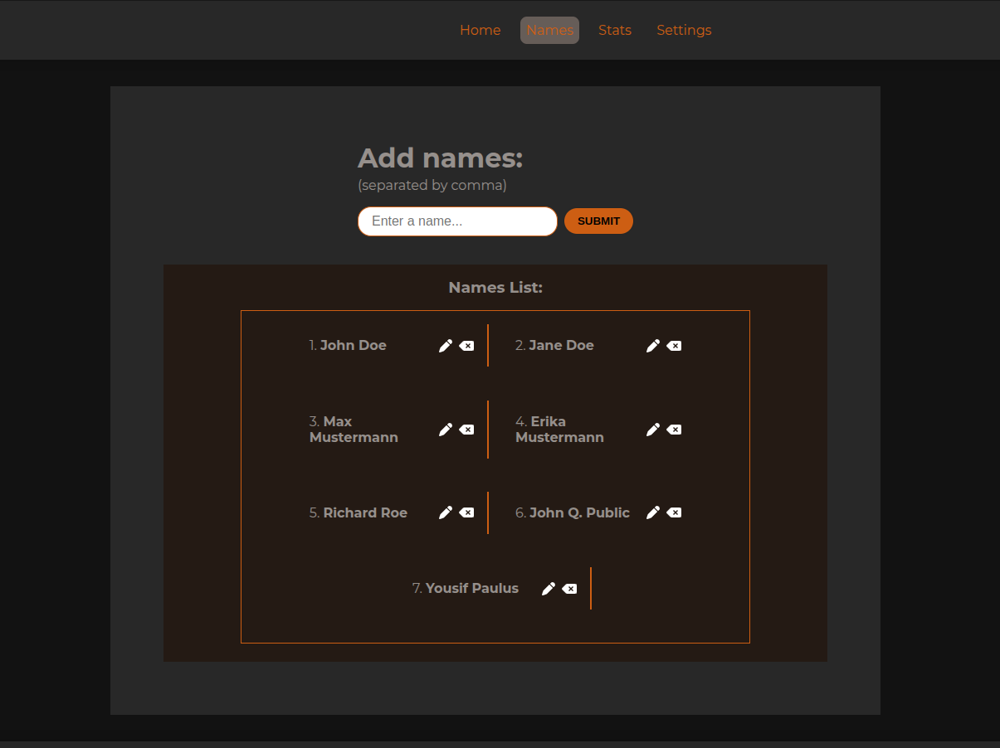

# Student Picker

A simple React application that randomly selects a student from a list, tracks selection statistics, and includes a theme toggler for an improved user experience.

[Live Demo](https://studentpicker.netlify.app/)

---

## Table of Contents

- [Overview](#overview)
- [Features](#features)
- [Screenshots](#screenshots)
- [Built With](#built-with)
- [Getting Started](#getting-started)
- [Project Structure](#project-structure)
- [Contributing](#contributing)
- [License](#license)
- [Acknowledgements](#acknowledgements)

---

## Overview

**Student Picker** is a lightweight React app designed for educators and teams to randomly choose a student from a list. The application stores student names and their pick statistics in the browser's localStorage, ensuring data persists between sessions. With a clean design and useful features like a theme toggler, this app is both practical and enjoyable to use.

---

## Features

- **Random Student Selection:** Pick a student at random from your list.
- **Persistent Data:** Uses localStorage to save names and selection stats across sessions.
- **Statistics Tracking:** Monitor how often each student is picked.
- **Theme Toggler:** Easily switch between light and dark modes.
- **Clean UI:** Simple, component-based design for an intuitive user experience.
- **Routing:** Implements React Router for smooth navigation between pages.
- **SVG Integration:** Uses `vite-plugin-svgr` for seamless SVG imports as React components.

---

## Screenshots

Here are some screenshots of the application in action:

### Home Screen


### Names Screen


### Stats Screen


---

## Built With

- [React](https://reactjs.org/)
- [Vite](https://vitejs.dev/)
- [React Router](https://reactrouter.com/)
- [vite-plugin-svgr](https://github.com/pd4d10/vite-plugin-svgr)

---

## Getting Started

Follow these instructions to set up the project locally.

### Prerequisites

- [Node.js](https://nodejs.org/) (version 14 or higher recommended)
- [npm](https://www.npmjs.com/) or [yarn](https://yarnpkg.com/)

### Installation

1. **Clone the repository:**

   ```bash
   git clone https://github.com/yourusername/student-picker.git
   cd student-picker
   ```

2. **Install dependencies:**

   ```bash
   npm install
   ```

3. **Run the development server:**

   ```bash
   npm run dev
   ```

4. **Open your browser:**

   Navigate to [http://localhost:3000](http://localhost:3000) (or the URL provided by Vite) to see the app in action.

### Deployment

This project is deployed on [Netlify](https://www.netlify.com/). The deployment configuration can be found in the `netlify.toml` file.

---

## Project Structure

Below is the directory structure of the project (excluding the `node_modules` folder):

```
.
├── eslint.config.js
├── index.html
├── netlify.toml
├── package.json
├── package-lock.json
├── public
├── README.md
├── src
│   ├── App.css
│   ├── App.jsx
│   ├── assets
│   │   ├── fonts
│   │   │   ├── Montserrat-Italic-VariableFont_wght.ttf
│   │   │   └── Montserrat-VariableFont_wght.ttf
│   │   ├── icons
│   │   │   ├── delete-left.svg
│   │   │   ├── moon.svg
│   │   │   ├── pen.svg
│   │   │   └── sun.svg
│   │   └── screenshots
│   │       ├── home.png
│   │       ├── names.png
│   │       └── stats.png
│   ├── Components
│   │   ├── css
│   │   │   ├── Names.css
│   │   │   ├── Navigation.css
│   │   │   ├── Picker.css
│   │   │   ├── Settings.css
│   │   │   ├── Stats.css
│   │   │   └── ThemeToggle.css
│   │   ├── Names.jsx
│   │   ├── Navigation.jsx
│   │   ├── Picker.jsx
│   │   ├── Settings.jsx
│   │   ├── Stats.jsx
│   │   └── ThemeToggle.jsx
│   ├── Context
│   │   ├── NameContext.jsx
│   │   └── ThemeContext.jsx
│   ├── index.css
│   ├── Layout
│   │   ├── Footer.css
│   │   ├── Footer.jsx
│   │   ├── Header.css
│   │   ├── Header.jsx
│   │   └── Layout.jsx
│   └── main.jsx
└── vite.config.js
```

---

## Contributing

Contributions are welcome! If you have ideas for improvements, bug fixes, or new features, please feel free to open an issue or submit a pull request.

---

## License

This project is licensed under the MIT License. See the [LICENSE](LICENSE) file for more details.

---


Happy coding!